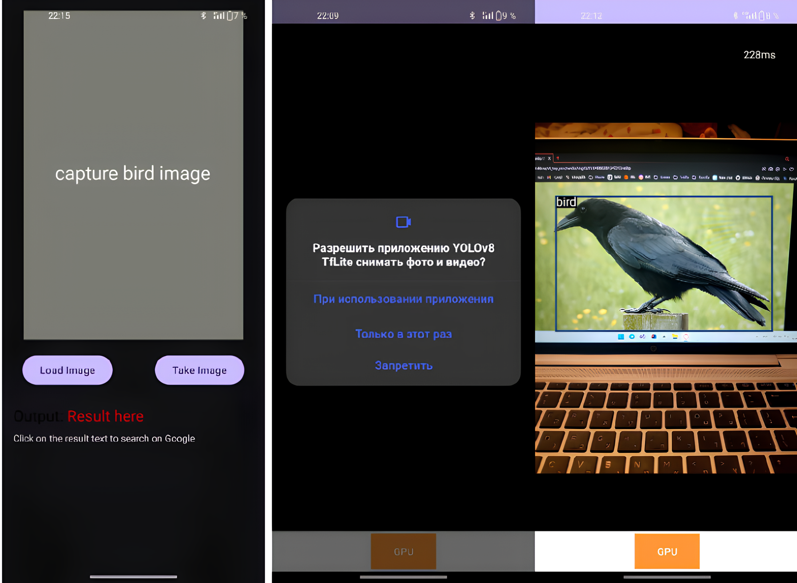
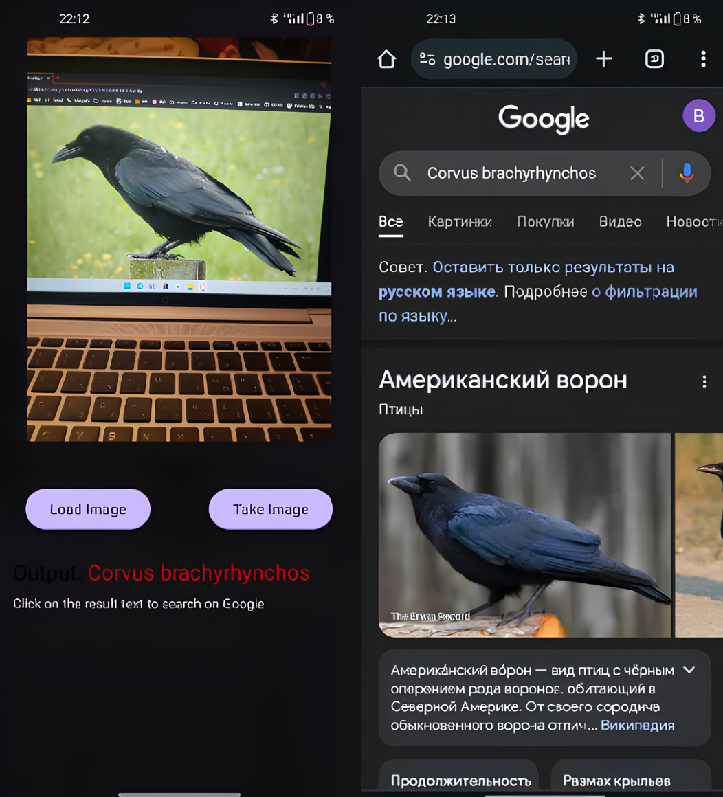

## Vобильное приложение распознавания птиц на изображении 
В ходе выполнения курсового проекта разработано мобильное
приложение распознавания птиц на изображении.В результате анализа предметной области определили, что для
создания мобильного приложения для распознавания птиц на
изображении необходимо использовать нейронные сети по детекции и
классификации сверточного типа.Средствами реализации выбраны язык программирования Kotlin,
операционная система Android.Работоспособность мобильного приложения проверена на
смартфоне с операционной системой Android 12.

## Работа приложения
При запуске приложения видим кнопки для загрузки изображения или съемки
через камеру, а также поле для изображения и вывода ответа.

В соответствии с изображениями 1 - 5 отметим корректность работы
приложения при выборе пользователем действия “Take image”. При выборе
кнопки “Take image” запрашивается доступ к камере. Происходит
детектирование птиц на изображении. После фиксации кадра
изображение обрабатывается и выводится на экран. Ответ, выдаваемый
нейронностью, является google - ссылкой и позволяет переход в
поисковик.
В соответствии с изображениями 6 - 8 заметим корректную работу
приложения при выборе действия “Load Image”. При выборе кнопки
“Load image” запрашивается доступ к файлам. Пользователь выбирает
изображение и загружает его в приложение. Изображение обрабатывается
и результат выводится на экран. Ответ, выдаваемый нейронностью,
является google - ссылкой и позволяет переход в поисковик.

1. Изображения 1-3

2. Изображения 4-5

3. Изображения 6-8 

